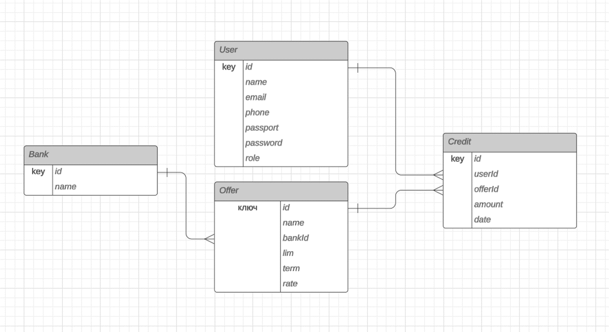

# Система учета и расчета кредитов

## Основные функции:

1. Ведение справочников банков и кредитных предложений
2. Ведение пользователей, ролевая модель доступа.
3. Учет кредитов пользователей, расчет графика платежей и итоговых сумм кредита.

## Схема базы данных



## Сборка и запуск

```
mvn clean install
```

```
mvn spring-boot:run
```

## Open API

http://localhost:8080/swagger-ui/index.html

## Исходный код проекта

https://github.com/veucos/cms
